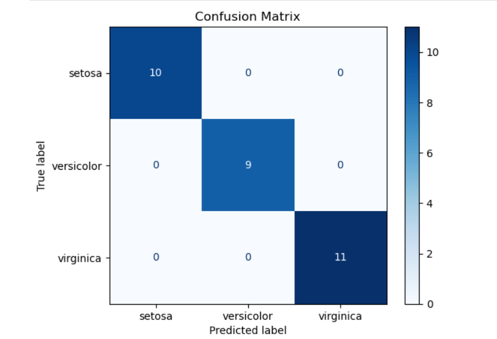

# iris-flower-classification-ML
This project uses the **Iris dataset** to train a machine learning model that classifies flowers into three species:
- Setosa
- Versicolor
- Virginica

## 📊 Model Training
The dataset was split into training and testing sets.  
A simple classification model (e.g., Logistic Regression) was trained using `scikit-learn`.

##  Results
- **Model Accuracy:** 100%
- **Confusion Matrix:**

✅ The model perfectly classified all test samples.

## ⚙️ Libraries Used
- Python
- pandas
- scikit-learn
- matplotlib (for visualization)
